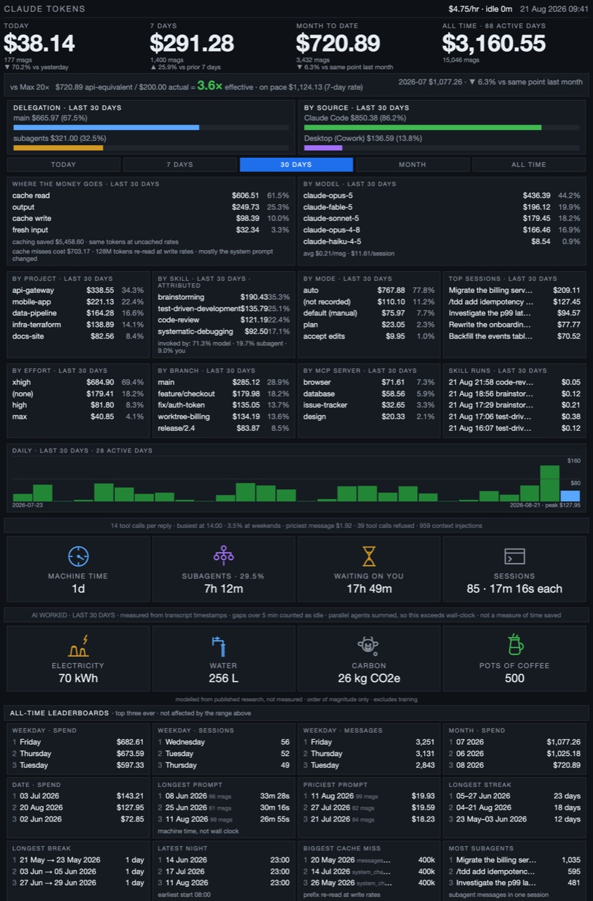

# Claude Code Token Dashboard

[](https://github.com/MathiasHC/claude-code-token-dashboard/actions/workflows/tests.yml)

A self-hosted dashboard for **Claude Code token usage and cost**. It reads the
transcripts Claude Code already writes on your own machine, shows what you
spent tokens on, and works out what that usage *would* have cost at Claude API
list rates if you were paying per token instead of on a subscription.

It is built for an always-on display — a spare tablet, a small screen on a
Raspberry Pi, a corner of a second monitor. The page carries no JavaScript and
refreshes itself with a `<meta>` tag, so it runs on browsers far too old for
anything modern.

Everything stays on your machine: no account, no telemetry, no network calls.

**No dependencies outside the Python standard library.**



*Every figure above is synthetic demo data, not real usage. Reproduce it with
`python3 tools/demo_page.py demo.html` and open the file — a way to see the
layout before you have any history of your own.*

**What it shows, top to bottom:**

- **Live burn rate** — `$8.03/hr · idle 0m` in the titlebar. Cost per hour of
  *active* time today; the only figure that changes between two refreshes.
- **Four windows** — today, last 7 days, month to date, all time, each with a
  message count and a like-for-like delta (vs yesterday, vs the prior 7 days,
  vs the same point last month).
- **What it would cost vs what you pay** — your api-equivalent spend against
  your actual plan, the resulting multiple, and where the month is **on pace**
  to land.
- **Delegation** — how much of the spend came from subagents rather than from
  your own turns.
- **By source** — Claude Code vs Claude Desktop (Cowork).
- **A date range you can pick** — today / 7 days / 30 days / this month / all
  time, as plain links. Everything below re-scopes; the top row never moves.
- **Where the money goes** — cache read vs output vs cache write vs fresh
  input, and what caching saved you.
- **By model, project, skill and session** — which models, repos, skills and
  individual pieces of work cost the most.
- **What the cache cost you** — beside what caching saved, what it failed to
  save: tokens re-processed at write rates because the prefix changed, and
  which change was to blame. The only figure on the page that is plainly
  wasted money.
- **By effort, branch and MCP server** — which reasoning effort, which git
  branch, and which MCP servers the spend went through. Loaded MCP servers
  sit in context on every turn, so that panel answers "is this worth keeping
  switched on".
- **A trivia line** — tool calls per reply, your busiest hour, the weekend
  share, the priciest single message, refused tool calls and context
  injections.
- **Which skills ran, when, and who started them** — a list of recent skill
  runs with the time, the cost and whether the model reached for it, you
  typed a slash command, or a subagent inherited it. On a real history that
  splits about 71% model, 19% subagent, 9% you — the model picks skills far
  more often than the person does.
- **By permission mode** — how much ran on auto versus plan, accept-edits or
  approve-each-action. Tracked as state through the transcript, since the
  messages themselves do not carry it. Sessions that never recorded a mode
  are shown as their own slice rather than folded into the majority.
- **Where the clock went** — four cards: machine time (model generating plus
  tools running), how much of it was subagents in parallel, how long it spent
  waiting on you, and how many sessions that was spread over. Measured from
  transcript timestamps rather than modelled. Explicitly *not* time saved —
  that needs a counterfactual the transcripts cannot supply. Method in
  [docs/machine-time.md](docs/machine-time.md).
- **A rough environmental estimate** — modelled kWh, litres of water and
  kg CO2e for the tokens in view, plus how many pots of coffee that would
  brew, along the bottom. Each has a small animated line drawing: a power station
  under a flickering bolt, a waterfall, a cow with a methane problem, and a
  coffee pot brewing. The animation is CSS keyframes cross-fading
  hand-drawn frames — no JavaScript, and it degrades to a static drawing on
  anything that will not animate. The estimate is good to about an order of
  magnitude and says so on the page; method and sources in
  [docs/footprint.md](docs/footprint.md).
- **A daily chart** — the last 30 active days across the full width, with
  today picked out and a value axis that snaps to round money: the $151 peak
  above draws lines at $80 and $160, so the bars are readable as amounts
  rather than only as relative heights.

## Requirements

Python 3.11 or newer, and Claude Code installed and used at least once — the
dashboard reads the transcripts it leaves in `~/.claude/projects`. There is
nothing to install and nothing to configure; a virtualenv is needed only to
run the tests.

## Install and run

```bash
git clone https://github.com/MathiasHC/claude-code-token-dashboard.git
cd claude-code-token-dashboard
python3 -m dashboard
```

The first run asks one question — **which Claude plan you're on** — because the
headline comparison is "what this usage would have cost at API rates versus
what you actually pay", and only you know the second half. The answer is saved
and never asked again. See [Which plan you're on](#which-plan-youre-on).

It prints a URL like `http://192.168.1.42:8420/d/AbC123…`. Open it locally to
check, then on whatever device you want it to live on.

Options: `--host` (default all interfaces), `--port` (default 8420).

## How it fits together

There are two roles, and they are usually different machines:

- **The host** reads the transcripts and serves the page. It must be the
  machine Claude Code actually runs on, because it reads that machine's
  `~/.claude` directory. It must also be awake — if it sleeps, the display
  shows a browser error until it wakes.
- **The display** is just a browser pointed at the printed URL. It needs
  nothing installed and does no work.

Give the host a reserved DHCP address on your router, or the URL breaks the
next time its IP changes.

## Deployment examples

### 1. An old tablet as a wall display

Almost any tablet too old for current apps still has a working browser, which
is all this needs.

1. Put the tablet on the **same network as the host**. The printed URL is a
   LAN address and is not reachable from anywhere else.
2. Turn off auto-lock (on iOS: **Settings → General → Auto-Lock → Never**) and
   leave it on a charger.
3. Open the printed URL in the browser.
4. Add it to the home screen (**Share → Add to Home Screen** on iOS, **⋮ → Add
   to Home screen** on Android) and launch from that icon, which drops the
   browser chrome and gives you the whole screen.

This is why the page is built the way it is. It was developed against
**iOS 5.1.1** — a browser with no CSS Grid, no modern flexbox, no custom
properties, no `rem` units and no usable ES5 — so the layout is tables and
`px`, and there is no JavaScript at all. `tests/test_render_html.py` enforces
that as a compatibility lint, so it cannot quietly regress. If it renders
there, it renders anywhere.

The page is laid out for a width of **1024** and is **1580px tall**, measured
in a 1024-wide frame rather than estimated. Everything down to and including
the daily chart fits a 1024×768 screen; the two card rows — machine time and
footprint — and the all-time leaderboards below them need a scroll.

Set `render_html.LEADERBOARD_COLUMNS` to `3` for wider boards at 1672px, or
drop the leaderboards from `render()` entirely to get back to 1210px.

That is a deliberate trade rather than an oversight. The drawings are only
worth having if they are big enough to read, and at 34px they were not —
a compact variant measures 815px, so shrinking them sacrifices the
legibility without buying the fold back. If you want the fold, the honest
levers are `DAILY_CHART_HEIGHT_PX` and merging the two bands, not the
cards.

### 2. A Raspberry Pi driving a small screen

A Pi with an HDMI or DSI panel makes a tidy dedicated dashboard. Here the Pi
is only the display — the host is still your development machine.

On Raspberry Pi OS with the desktop, start Chromium in kiosk mode at login by
creating `~/.config/autostart/dashboard.desktop`:

```ini
[Desktop Entry]
Type=Application
Name=Token dashboard
Exec=chromium-browser --kiosk --incognito --noerrdialogs --disable-infobars http://HOST-IP:8420/d/YOUR-TOKEN
X-GNOME-Autostart-enabled=true
```

Stop the screen blanking by adding this to the same autostart directory, or to
your session startup:

```bash
xset s off && xset -dpms && xset s noblank
```

On a Pi running Wayland (Bookworm and later), `wlr-randr` and your compositor's
idle settings replace `xset`; the Chromium flags are unchanged.

If Claude Code runs **on** the Pi — or on any always-on Linux box you SSH into
— run the dashboard there too and keep it up with a user service, so it
survives reboots:

```ini
# ~/.config/systemd/user/token-dashboard.service
[Unit]
Description=Claude token dashboard
[Service]
WorkingDirectory=%h/claude-token-dashboard
ExecStart=/usr/bin/python3 -m dashboard --port 8420 --plan max-20x
Restart=always
[Install]
WantedBy=default.target
```

```bash
systemctl --user enable --now token-dashboard
loginctl enable-linger "$USER"   # keep it running when you are logged out
```

`--plan` is spelled out in the unit because a service has no terminal to be
asked on — see [Which plan you're on](#which-plan-youre-on).

### 3. A second monitor, or no extra hardware at all

The lowest-effort option: run it on the machine you already work on and leave
`http://localhost:8420/d/YOUR-TOKEN` open in a pinned browser tab, or full
screen on a second monitor. Everything above about networks and IP addresses
stops mattering, because there is only one machine.

## Which plan you're on

The first interactive run asks, offering the common plans and letting you type
any amount instead:

```
Which Claude plan are you on? This is only used for the
'vs plan' comparison — everything else is unaffected.

  1. API only — no subscription
  2. Pro — $20/month
  3. Max 5× — $100/month
  4. Max 20× — $200/month  (default)
  5. Team — $25/month
  6. Something else — enter the monthly amount you pay

Plan [4]:
```

What actually gets stored is **a monthly dollar figure**, not a plan name — the
menu is just a fast way to pick one. Annual billing is cheaper than the prices
above (Pro is $17/month on an annual plan), Team seats vary, and Enterprise is
seat price plus usage, so anyone in those cases picks option 6 and enters what
they really pay. Prices here are monthly-billing rates as of August 2026 and
are Anthropic's to change; the amount you enter is the one that's used.

Picking **API only** drops the multiple entirely — with no subscription the
api-equivalent figure *is* your bill, and a ratio against $0 would be noise.

Set it without the prompt, or change it later:

```bash
python3 -m dashboard --plan max-5x     # a listed plan, saved for next time
python3 -m dashboard --plan 149        # any monthly amount
CLAUDE_DASHBOARD_PLAN=pro python3 -m dashboard   # one-off, not saved
```

Resolution order is `--plan` → `CLAUDE_DASHBOARD_PLAN` → the saved config →
the prompt → Max 20×. The answer lives in
`~/.claude-token-dashboard/config.json` (override with
`CLAUDE_DASHBOARD_CONFIG`); delete that file to be asked again.

> **Running as a service? Set the plan first.** A systemd unit, a login
> autostart, or a container has nobody to answer a prompt, so the dashboard
> never asks when stdin isn't a terminal — it warns on stderr and falls back to
> Max 20× rather than blocking forever on a port that never opens. Run it once
> by hand, or pass `--plan` in the unit file.

## Follow-up: real billed cost from the Claude API

Everything this dashboard shows is **reconstructed** from local transcripts and
priced at list rates. If you also call the Claude API directly, Anthropic will
tell you what you were *actually billed* — and that is the one number this tool
can't derive.

This section is a guide, not a feature: **nothing here is wired into the
dashboard**, and no credentials belong in this repository. Follow it if you
want the real figures alongside the estimate.

### First, check whether it applies to you

| You are | What you get |
|---|---|
| On a **Console (Claude Platform) organization** | The Usage & Cost Admin API below |
| On **Claude Enterprise** (claude.ai) | A different API — the [Enterprise Analytics API](https://platform.claude.com/docs/en/api/admin/analytics), with an Analytics key |
| An **individual account** | Nothing — see below |
| Using **Claude Platform on AWS** | Not available programmatically; use the Console's Usage and Cost pages |

> **The Admin API is unavailable for individual accounts.** If you use Claude
> Code on a personal Pro or Max subscription and have never set up a Console
> organization, there is no key to create and this section does not apply. A
> Max subscription is not an API account — the two are billed separately.

### 1. Create an Admin API key

In the Claude Console, under organization settings — see
[Create an Admin API key](https://platform.claude.com/docs/en/manage-claude/admin-api-keys).
It is **not** the same as a normal API key and looks like `sk-ant-admin01-…`.

Treat it as a high-privilege credential: it reads organization-wide billing.
Keep it in your shell environment or a secrets manager, never in a file in a
repository:

```bash
export ANTHROPIC_ADMIN_KEY='sk-ant-admin01-...'   # not committed anywhere
```

### 2. Tokens — the usage report

```bash
curl -s "https://api.anthropic.com/v1/organizations/usage_report/messages?\
starting_at=2026-08-01T00:00:00Z&\
ending_at=2026-08-08T00:00:00Z&\
bucket_width=1d&\
group_by[]=model" \
  -H "anthropic-version: 2023-06-01" \
  -H "x-api-key: $ANTHROPIC_ADMIN_KEY"
```

Buckets are `1m`, `1h`, or `1d`, capped at 1440 / 168 / 31 buckets per request
respectively. You can group and filter by model, workspace, API key, service
tier, and context window. Token classes come back split the same way this
dashboard splits them — uncached input, cached input, cache creation, output —
so the two are directly comparable.

### 3. Dollars — the cost report

```bash
curl -s "https://api.anthropic.com/v1/organizations/cost_report?\
starting_at=2026-08-01T00:00:00Z&\
ending_at=2026-08-31T00:00:00Z&\
group_by[]=description" \
  -H "anthropic-version: 2023-06-01" \
  -H "x-api-key: $ANTHROPIC_ADMIN_KEY"
```

Daily granularity only. **Costs are returned as decimal strings in the
currency's lowest unit (cents)** — divide before comparing them to anything on
this page, and don't parse them as floats if you care about exactness.

### 4. Things that will bite you

- **Both endpoints paginate.** Check `has_more` and pass `next_page` back as
  `page` until it is false, or you will silently read only the first slice.
- **Priority Tier spend is missing from the cost report** — track it through
  the usage report's `service_tier` instead.
- **Code execution is the mirror image**: it appears only in the *cost* report,
  under a `Code Execution Usage` description, and not in the usage report.
- **Data lags a few minutes**, and poll no more than about once a minute.
- Console Workbench usage has a `null` api_key_id; the default workspace has a
  `null` workspace_id. Neither is an error.

### 5. Why this isn't merged into the dashboard

The two sources are not the same measurement, and adding them together would
produce a number that means nothing. This tool reconstructs what *subscription*
usage would have cost at list rates; the Admin API reports what an *API
organization* was actually charged. If you wire this up, keep it as its own
panel with its own heading — as the "By source" split already does for the
surfaces that are covered.

Reference: [Usage and Cost API](https://platform.claude.com/docs/en/api/usage-cost-api).

## Choosing a date range

A row of links under the bands re-scopes every panel below it:

```
[ TODAY ] [ 7 DAYS ] [ 30 DAYS ] [ MONTH ] [ ALL TIME ]
```

"Where the money goes", "by model", "by project", "by skill", "top sessions",
the delegation and source splits, and the daily chart all follow the selection.
Percentages are relative to the selected range, so a panel's shares always add
up to what that panel is showing.

**The hero row never moves.** Today / 7 days / month-to-date / all-time, and
their deltas, are the fixed summary — if they changed with the selection the
page would be arguing with itself.

They are plain links (`?range=7d`), not a dropdown or clickable cards. This
page carries no JavaScript, so a `<select>` would need a visible submit button
and cards would give no hint they can be clicked. Links work on every browser
ever shipped, and the current one is marked server-side rather than with
`:hover`.

**The default is 30 DAYS**, and a selected range sticks. The page
auto-refreshes in place, so the data updates on its usual interval while the
range you chose stays put. Click `30 DAYS` to get back to the default, or
`ALL TIME` for everything.

This was the other way round at first — the refresh returned to `ALL TIME` on
the theory that a wall display should always show one glanceable screen. It
reset the selection roughly every 30 seconds, which made a range impossible to
actually read.

The trade-off is worth knowing: a wall display left on `TODAY` will stay on
`TODAY` indefinitely. Nothing puts it back except a click on `ALL TIME`, or
reopening the bare URL.

## What the numbers mean

- **api-equivalent cost** — what the usage would have cost at Claude API list
  rates. It models no batch discounts and no promotional rates. It is a
  comparison figure, not a bill.
- **vs &lt;your plan&gt;** — that figure against what you actually pay per month,
  and the resulting multiple. See [Which plan you're on](#which-plan-youre-on).
- **cache read / cache write** — cache reads bill at 0.1× the input rate;
  writes at 1.25× (5-minute TTL) or 2× (1-hour TTL). Most cost is usually
  cache reads rather than output, because context replay dominates.
- **Delegation** — how much of the spend came from subagents rather than your
  direct session. Subagent cost is attributed to the parent session and
  project as well, so it is counted once in the totals and shown again in the
  split.
- **By source** — which Claude surface the spend came from. Only surfaces that
  keep token counts on disk can appear; see "Which surfaces are covered".
- **All-time leaderboards** — twelve top-threes at the foot of the page:
  spend, sessions and messages by weekday; the priciest month and date; the
  longest and priciest prompt; streaks and breaks; latest night; biggest
  cache miss; most subagents in one session. A **prompt** is one thing you
  typed plus everything the machine did answering it, and its length is
  machine time rather than elapsed, so a prompt left open overnight does not
  win.
- **Panels follow the selected range; the top row never does.** The hero row
  and the plan comparison are always the same four windows, whatever is
  selected. Everything below the range selector re-scopes, and each panel
  states its range in its heading. The default is the last 30 days. The one
  exception is the leaderboard section, which is all-time and says so in its
  heading — a top three that re-ranked itself per range would not be a top
  three.
- **caching saved** — what your cache reads *would* have cost at full input
  rates. A counterfactual, not money that was ever at stake: cache reads bill
  at 0.1×, so this is the 0.9× you never paid.
- **on pace** — month-to-date plus the trailing-7-day daily rate over the days
  remaining. A projection, and the only figure here that can be wrong rather
  than merely stale. Hidden for the first three days of a month, when the
  trailing window is mostly last month.
- **$/hr · idle** — cost over *active* time today, where gaps between messages
  count for at most five minutes each, so a session left open over lunch does
  not dilute it. Hidden until there is at least 15 minutes of active time;
  below that the denominator is too small to divide by and the rate reads
  wildly high.

Rates live in `dashboard/pricing.py` as a plain table. They will go stale as
models are released and repriced; editing that table is the whole update.

## Which surfaces are covered

| Surface | Counted? | Why |
|---|---|---|
| Claude Code | yes | writes transcripts with per-message `usage` |
| Claude Desktop — Cowork | yes | same transcript format, different root |
| Claude API / Console | no | billed server-side — see [Follow-up: real billed cost](#follow-up-real-billed-cost-from-the-claude-api) |
| Claude Desktop — chat | no | no token counts stored locally |
| Claude in Chrome | no | proxies claude.ai, same as chat |

The three "no" rows are a property of the data, not a gap in this tool. Those
surfaces bill server-side and persist no usage on disk — the claude.ai
IndexedDB, Local Storage and web log contain no token fields at all. The only
local trace of them is Claude Desktop's `plan-usage-history.json`, which
records *percentage of your plan's 5-hour and 7-day limits consumed*:
account-wide, and not convertible to tokens or dollars, so it is deliberately
not mixed into these totals.

## Where the data lives

- Read recursively from `~/.claude/projects/**/*.jsonl` (override with
  `CLAUDE_PROJECTS_DIR`). This includes both main-session transcripts and
  subagent transcripts nested under `<session>/subagents/`, so delegated work
  is counted alongside direct sessions.
- And from Claude Desktop's Cowork sessions (override with
  `CLAUDE_COWORK_DIR`, skipped silently if absent — so this costs nothing on
  a machine without Claude Desktop, including Linux):

  ```
  ~/Library/Application Support/Claude/local-agent-mode-sessions/
    <install>/<org>/local_<id>/.claude/projects/<encoded-cwd>/<session>.jsonl
  ```

  Cowork runs Claude Code with HOME redirected per session, so each session
  keeps a full private transcript tree in the same format. Every session also
  writes an `audit.jsonl` repeating the same `message.id` values; dedup drops
  it, so the mirror adds nothing. Because every Cowork session runs in a
  directory called `outputs`, project labels come from the session's sidecar
  JSON — the folder you pointed it at, else its title — rather than the cwd.
- Accumulated in `~/.claude-token-dashboard/history.db` (override with
  `CLAUDE_DASHBOARD_DB`), insert-only and keyed on message ID, so re-scanning
  never double-counts and history survives Claude Code deleting old
  transcripts. Older databases are migrated in place on open.
- The access token is `~/.claude-token-dashboard/token`. Delete it to roll the
  URL; a new one is generated on the next start.

  Tokens are 16 characters of Crockford base32 — one case, and no `I`, `L`,
  `O` or `U`, so there is no `1`/`I` or `0`/`O` to get wrong. Matching is
  deliberately forgiving of how transcription actually fails: case is
  ignored, `I`/`L`/`O` fold to `1`/`1`/`0`, and hyphens or spaces you add to
  break the string up are ignored too. Tokens issued before this still work
  and are matched case-insensitively, but are not folded — they may contain
  a literal `I` or `L` that means itself.

  None of that widens the target beyond a small equivalence class around one
  16-character secret, which is still far past guessing on a home network.

  At startup the URL is also printed as a QR code when the terminal can show
  one. Not much help to a first-generation iPad, which has no camera — but it
  saves retyping on anything newer.
- Your plan answer is `~/.claude-token-dashboard/config.json` (override with
  `CLAUDE_DASHBOARD_CONFIG`). Delete it to be asked again.

Nothing leaves your machine. There is no telemetry, no account of any kind,
and no outbound request — the dashboard only ever reads local files and serves
them back on your own LAN.

One line looks like an exception and is worth explaining, because you will
find it if you read the source. `web.local_ip()` opens a **UDP** socket
towards `8.8.8.8:80` purely to ask the kernel which local interface would be
used, so the startup banner can print a URL your other devices can reach.
UDP `connect()` transmits nothing — no packet is sent to that address, and it
falls back to `127.0.0.1` if there is no route. Nothing is resolved, sent or
received.

## Refresh cost

A refresh re-reads only what changed. Transcripts are append-only, so each one
records a byte offset and a digest of the bytes already consumed; the next
pass resumes from that offset instead of re-parsing the file. On a
multi-megabyte transcript that turns an append from hundreds of milliseconds
into well under one.

The offset is only trusted when the file is demonstrably the same one,
extended — a truncated file, a rewritten one, or a row predating offsets falls
back to a full re-read. Records are keyed on message ID, so a redundant
re-read costs time and nothing else.

What remains scales with total history rather than with the number of files:
reading every row back out of SQLite and rebuilding the all-time panels.
Making that sublinear means keeping a rollup rather than aggregating from raw
rows, which has not been needed yet.

## Security

Plain HTTP on your LAN behind an unguessable path. No TLS, no login. That is
enough to stop someone on your home network stumbling across it; it is **not**
safe on a hostile network, and the token appears in the URL, so it will sit in
browser history and any proxy logs in between.

**Do not forward the port to the internet.** If you need it away from home,
put it behind a VPN or an authenticating reverse proxy rather than exposing it
directly.

**Keep the port in the URL.** If something else on the machine serves port 80
— Apache and nginx both do by default on macOS and many Linux installs — then
a URL missing its `:8420` reaches that server instead, and its 404 looks
exactly like a wrong token. The dashboard checks port 80 at startup and warns
you by name if anything is there.

## Troubleshooting

**`Port 8420 is already in use`** — it is already running, most likely in
another terminal or as a service. Find the process, or use a different port:

```bash
lsof -nP -iTCP:8420 -sTCP:LISTEN     # macOS / Linux — what has the port
python3 -m dashboard --port 8421     # or just use another one
```

On a checkout older than [#2](https://github.com/MathiasHC/claude-code-token-dashboard/pull/2)
this surfaced as a socket traceback ending in `self.socket.bind(...)` rather
than a message — see [#3](https://github.com/MathiasHC/claude-code-token-dashboard/issues/3).
Pull the latest `main` and it explains itself.

**Everything reads $0.00, or "no data yet"** — the dashboard reads transcripts
that Claude Code writes locally, so there is nothing to show until Claude Code
has actually been used *on this machine*. Check there are transcripts:

```bash
find ~/.claude/projects -name '*.jsonl' | head
```

If they live somewhere else, point at them with `CLAUDE_PROJECTS_DIR`. Note the
dashboard must run on the machine Claude Code runs on — see
[How it fits together](#how-it-fits-together).

**The page won't load from the tablet or Pi** — in rough order of likelihood:
the host machine is asleep; the two devices are on different networks (a guest
SSID will do it); the host's IP changed since you bookmarked it; or a firewall
is blocking the port. Confirm it works on the host first with
`http://localhost:8420/d/YOUR-TOKEN`, which rules the dashboard itself in or
out before you start debugging the network.

**It's comparing against the wrong plan** — pass `--plan` once to change it, or
delete `~/.claude-token-dashboard/config.json` to be asked again. See
[Which plan you're on](#which-plan-youre-on).

**`error: externally-managed-environment` from pip** — that is PEP 668 on
Homebrew, Debian and Raspberry Pi OS refusing a system-wide install. Only the
tests need pip; use the virtualenv in [Tests](#tests). Running the dashboard
itself needs nothing installed.

**The URL stopped working after a restart** — the access token is stable and
lives in `~/.claude-token-dashboard/token`; if that file was deleted, a new one
was generated and the old URL is dead. Print the current one with
`cat ~/.claude-token-dashboard/token`.

## Tests

Some Python installations are "externally managed" (PEP 668 — Homebrew,
Debian, Raspberry Pi OS) and refuse a bare `pip install`, so use a virtualenv:

```bash
python3 -m venv .venv
.venv/bin/python -m pip install -e '.[dev]'
.venv/bin/python -m pytest -q
```

The suite never asserts against your real `~/.claude` tree, because its totals
change with every message. There is an opt-in smoke check that runs against
live data and asserts only shape:

```bash
DASHBOARD_LIVE_SMOKE=1 .venv/bin/python -m pytest -k live
```

## Licence

MIT — see [LICENSE](LICENSE).
